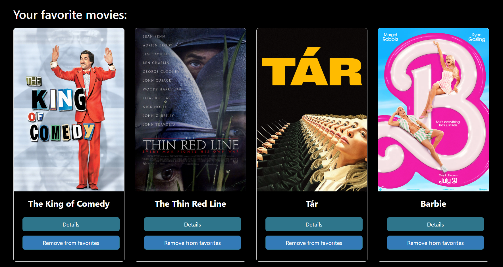

# fletNix App #

## Project Description ##

This app allows users to access a library of movies; displaying information about each movies, such as genre and director. Users can register an account, login, browse through the list of movies, see movies of similar genres, and add movies to a list of favorites, which then appears on their profile page. Users can also update their credentials and delete their account.

This project was built using React to create the front-end of the app and is a Single Page Application (SPA). The app is connected to a API which was created in another project (see <a>https://github.com/philippeducasse/movie_api</a>). 

## LINK ##

https://flet-nix.netlify.app/

## Screenshots ##

## Technollogies used

- React
- Parcel (build tool)
- JSX
- React Bootstrap
- Redux (state management)
- Client-side routing

## Setting up the project

To run this project on your machine, install first install parcel by running these commands in your folder directory

- npm install parcel

then install react:

- npm install --save react react-dom

to build the app, run 

- parcel [path to index.html]

## Credits

Thank you to my mentor from CareerFoundry, Treasure Kabareebe & my tutor Jonathan Nshuti. Special thanks to my friend Stephen Duke. 
